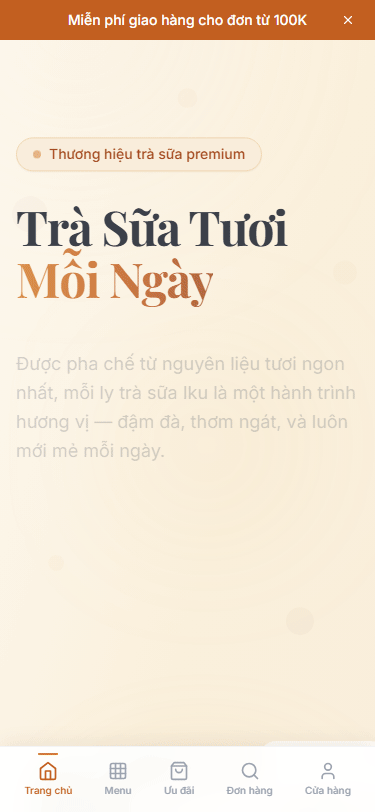
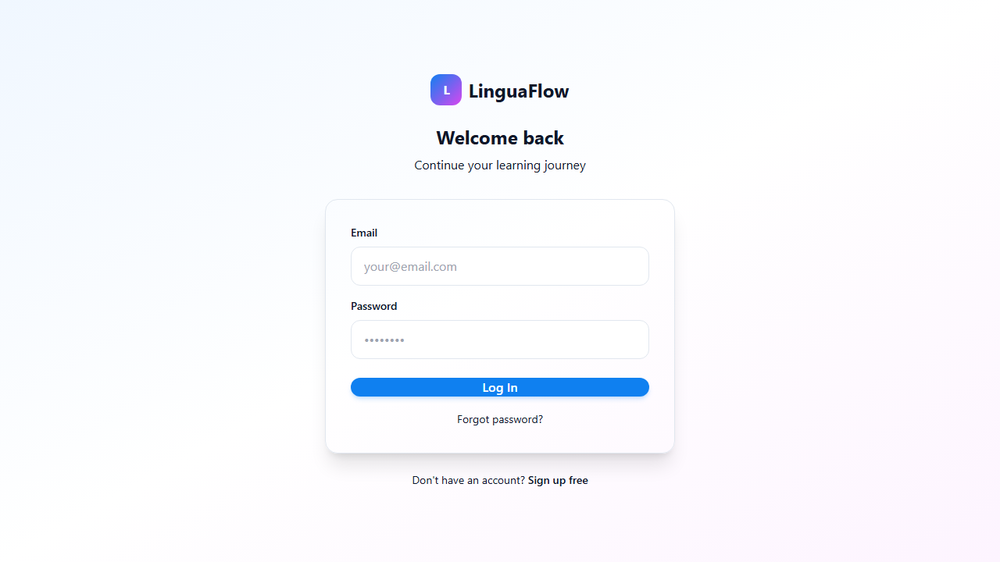
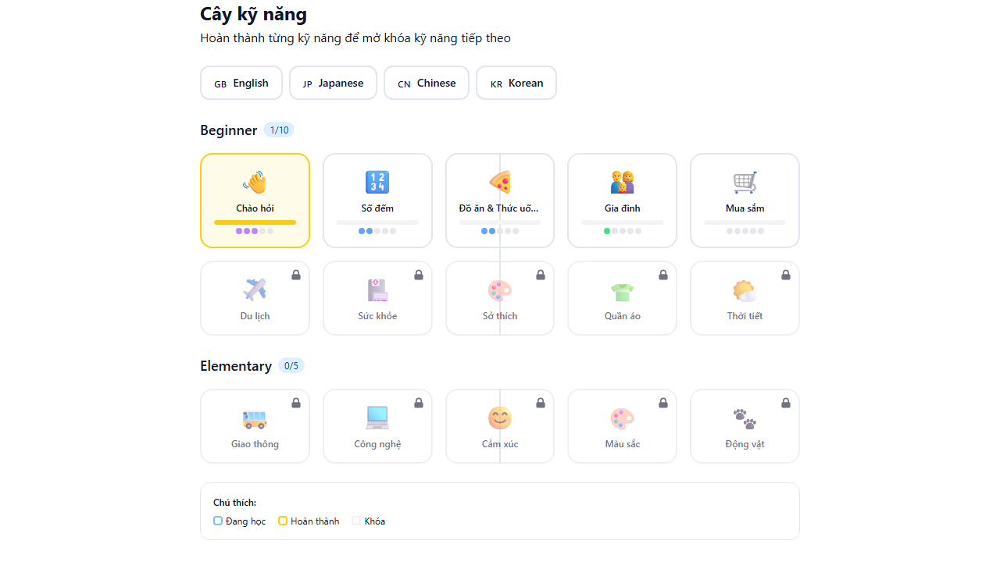
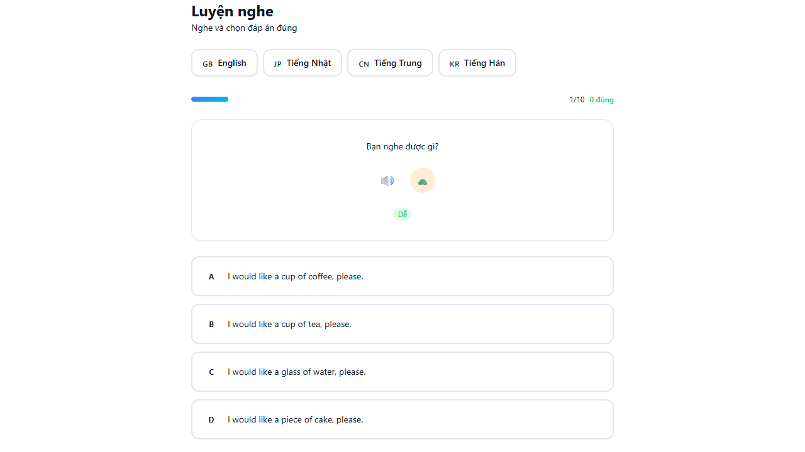
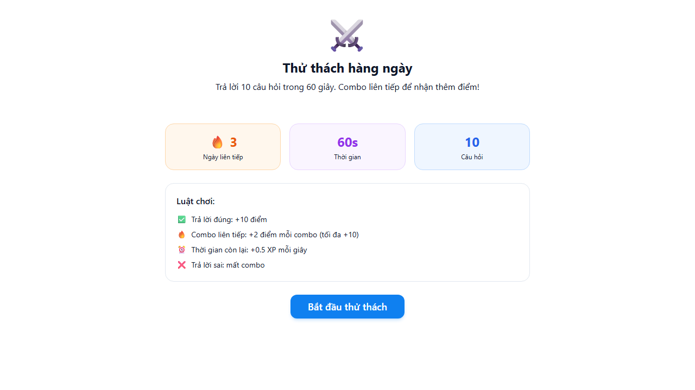
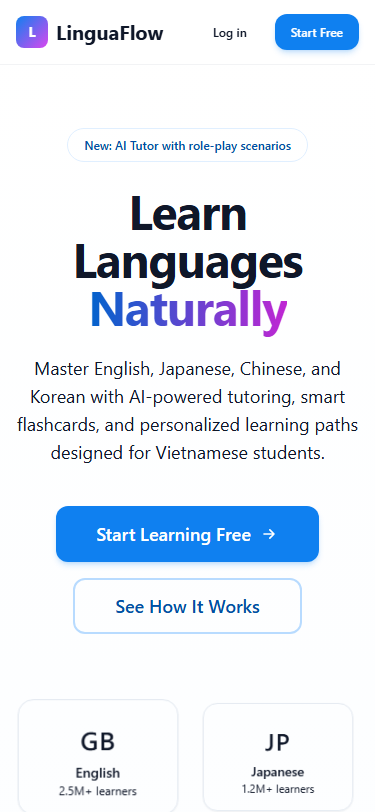
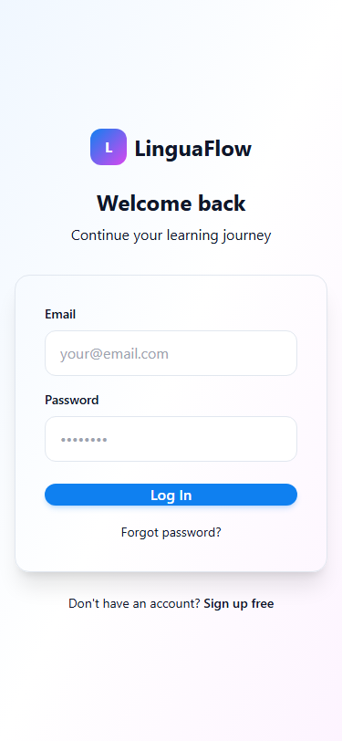

<div align="center">

# 🎓 LinguaFlow

**Nền tảng học ngôn ngữ thông minh cho người Việt**

[](LICENSE)
[](https://nodejs.org)
[](https://nextjs.org)
[](https://www.typescriptlang.org)
[](https://hub.docker.com/u/nguyenson1710)

[](web/e2e/)
[](https://web-lca3ll2b5-nguyen-sons-projects-4f98af92.vercel.app)
[](CONTRIBUTING.md)

[Demo](https://linguaflow.app) · [Tài liệu API](docs/api.md) · [Báo lỗi](https://github.com/JasonTM17/Language_App/issues)

</div>

---

## Giới thiệu

LinguaFlow là nền tảng học ngôn ngữ toàn diện được thiết kế riêng cho người Việt Nam. Hỗ trợ 4 ngôn ngữ: **Tiếng Anh**, **Tiếng Nhật**, **Tiếng Trung**, và **Tiếng Hàn** với hệ thống AI Tutor, gamification, và spaced repetition.

### Tính năng nổi bật

| Tính năng | Mô tả |
|-----------|--------|
| **AI Tutor** | Trợ lý AI hỗ trợ học tập cá nhân hóa |
| **Spaced Repetition** | Thuật toán SM-2 tối ưu hóa ghi nhớ dài hạn |
| **Gamification** | XP, streak, leaderboard, achievements |
| **4 kỹ năng** | Nghe, Nói, Đọc, Viết với bài tập tương tác |
| **Skill Tree** | Lộ trình học từ Beginner đến Advanced |
| **PWA** | Cài đặt như app native, hoạt động offline |
| **Dark Mode** | Giao diện tối bảo vệ mắt |
| **Responsive** | Tối ưu cho mobile, tablet, desktop |

---

## Screenshots

### Demo

| Desktop | Mobile |
|:---:|:---:|
|  |  |

### Desktop

| Landing Page | Dashboard | Skill Tree |
|:---:|:---:|:---:|
|  |  |  |

| Listening | Daily Challenge | AI Tutor |
|:---:|:---:|:---:|
|  |  |  |

### Mobile

| Landing | Dashboard | Vocabulary |
|:---:|:---:|:---:|
|  |  |  |

---

## Kiến trúc

```
linguaflow/
├── api/                    # Backend REST API
│   ├── src/
│   │   ├── routes/         # 38 API endpoints
│   │   ├── middleware/     # Auth, rate-limit, validation
│   │   ├── database/      # Prisma ORM + SQLite
│   │   └── types/         # TypeScript definitions
│   ├── prisma/             # Schema & migrations
│   └── tests/              # 129 unit & integration tests
├── web/                    # Frontend Next.js App
│   ├── src/
│   │   ├── app/            # 50+ pages (App Router)
│   │   ├── components/     # Reusable UI components
│   │   ├── hooks/          # Custom React hooks
│   │   ├── lib/            # Utilities & helpers
│   │   └── types/          # Shared type definitions
│   └── public/             # Static assets & PWA
├── docker-compose.yml      # Container orchestration
└── docs/                   # Documentation
```

### Tech Stack

**Frontend:**
- Next.js 14 (App Router, Server Components)
- React 18 + TypeScript 5.4
- Tailwind CSS 3.4 + Radix UI
- Framer Motion (animations)
- Zustand (state management)
- TanStack Query (data fetching)
- Lucide React (icons)

**Backend:**
- Express.js + TypeScript
- Prisma ORM + SQLite
- JWT Authentication
- Zod (validation)
- Helmet + CORS + Rate Limiting

**Infrastructure:**
- Docker (multi-stage builds)
- PWA (Service Worker, offline support)
- GitHub Actions CI/CD

---

## Cài đặt

### Yêu cầu

- Node.js >= 20.0
- npm >= 10.0
- Docker (optional, cho deployment)

### Development

```bash
# Clone repository
git clone https://github.com/JasonTM17/Language_App.git
cd Language_App

# Cài đặt dependencies
cd api && npm install && cd ../web && npm install && cd ..

# Khởi tạo database
cd api
cp .env.example .env
npx prisma migrate dev
npm run db:seed

# Chạy development servers
# Terminal 1 - API (port 3001)
cd api && npm run dev

# Terminal 2 - Web (port 3000)
cd web && npm run dev
```

### Docker

```bash
# Build và chạy toàn bộ stack
docker compose up -d

# Hoặc build riêng từng service
docker compose build api
docker compose build web
```

### Environment Variables

```env
# api/.env
DATABASE_URL="file:./dev.db"
JWT_SECRET="your-secret-key-change-in-production"
PORT=3001
NODE_ENV=development
```

---

## API Reference

Base URL: `http://localhost:3001/api`

### Authentication

| Method | Endpoint | Mô tả |
|--------|----------|--------|
| POST | `/auth/register` | Đăng ký tài khoản |
| POST | `/auth/login` | Đăng nhập |
| POST | `/auth/refresh` | Refresh token |
| POST | `/auth/forgot-password` | Quên mật khẩu |

### Vocabulary

| Method | Endpoint | Mô tả |
|--------|----------|--------|
| GET | `/vocabulary` | Danh sách từ vựng |
| POST | `/vocabulary` | Thêm từ mới |
| GET | `/vocabulary/review` | Từ cần ôn tập (SRS) |
| POST | `/vocabulary/:id/review` | Ghi nhận kết quả ôn tập |

### Progress & Gamification

| Method | Endpoint | Mô tả |
|--------|----------|--------|
| GET | `/progress` | Tiến độ học tập |
| GET | `/progress/streak` | Streak hiện tại |
| GET | `/leaderboard` | Bảng xếp hạng |
| GET | `/achievements` | Thành tích |
| POST | `/daily-challenge` | Thử thách hàng ngày |

### Quiz & Exercises

| Method | Endpoint | Mô tả |
|--------|----------|--------|
| GET | `/quiz/:language` | Lấy câu hỏi quiz |
| POST | `/quiz/submit` | Nộp bài quiz |
| GET | `/exercises/:type` | Bài tập theo loại |

[Xem đầy đủ API docs →](docs/api.md)

---

## Testing

```bash
# Chạy toàn bộ test suite
cd api && npm test

# Chạy với coverage
cd api && npx vitest run --coverage

# Type checking
cd api && npx tsc --noEmit
cd web && npx tsc --noEmit
```

**Test coverage:** 16 test files, 129 tests passing

---

## Deployment

### Docker Images

Images có sẵn trên [Docker Hub](https://hub.docker.com/u/nguyenson1710):

```bash
# Pull từ Docker Hub
docker pull nguyenson1710/linguaflow-api:v1.0.0
docker pull nguyenson1710/linguaflow-web:v1.0.0

# Hoặc build từ source
docker build -t linguaflow-api:latest ./api
docker build -t linguaflow-web:latest ./web
```

### Render

Dự án được cấu hình sẵn cho Render deployment:
- **API**: Web Service (Docker)
- **Web**: Static Site hoặc Web Service (Docker)

### Cấu hình Production

```env
NODE_ENV=production
JWT_SECRET=<strong-random-secret>
DATABASE_URL=file:./data/linguaflow.db
```

---

## Đóng góp

1. Fork repository
2. Tạo feature branch (`git checkout -b feature/ten-tinh-nang`)
3. Commit changes (`git commit -m 'feat: mô tả'`)
4. Push to branch (`git push origin feature/ten-tinh-nang`)
5. Tạo Pull Request

### Commit Convention

```
feat: tính năng mới
fix: sửa lỗi
docs: cập nhật tài liệu
style: format code
refactor: tái cấu trúc
test: thêm/sửa test
chore: công việc maintenance
```

---

## Giấy phép

Dự án được phân phối dưới giấy phép [MIT](LICENSE).

---

## Tác giả

**Nguyễn Sơn** — [@JasonTM17](https://github.com/JasonTM17)

---

<div align="center">

Made with ❤️ in Vietnam

</div>
