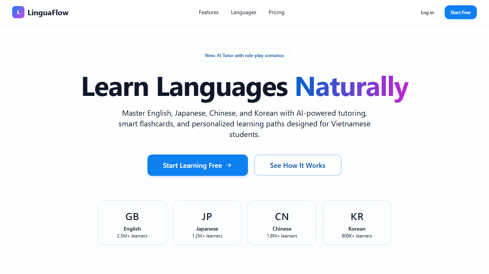
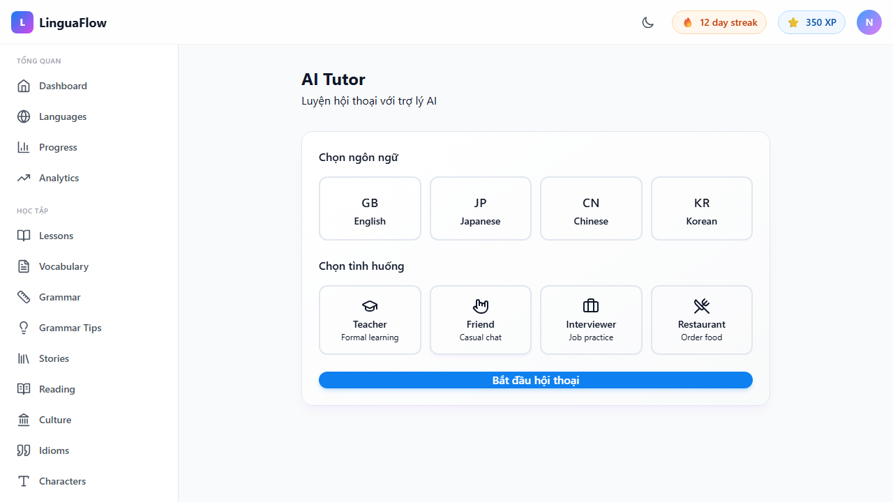
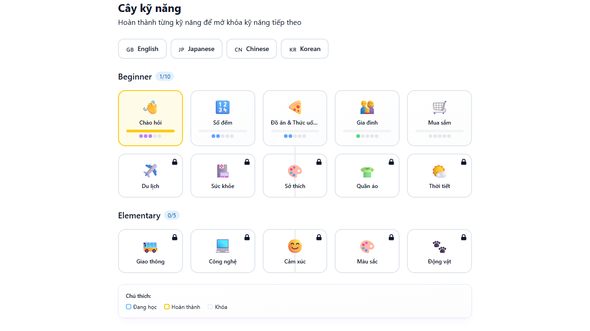
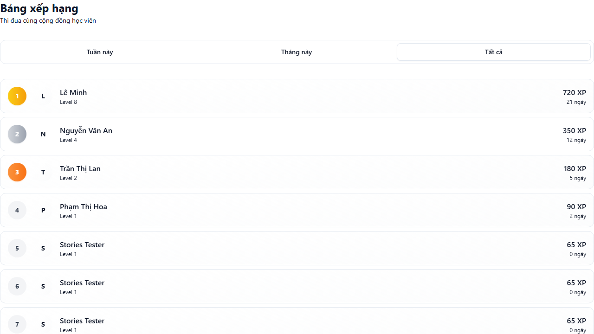
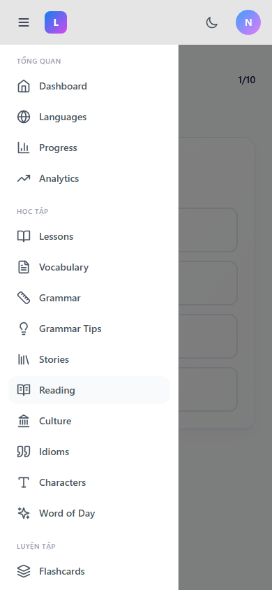
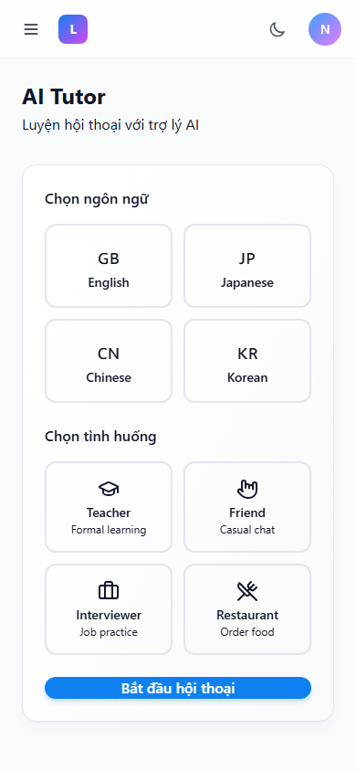

<p align="center">
  
</p>

<h1 align="center">LinguaFlow</h1>

<p align="center">
  <strong>Nền tảng học ngôn ngữ thông minh dành cho người Việt</strong><br/>
  Học Tiếng Anh, Nhật, Trung, Hàn với spaced repetition, gamification và lộ trình cá nhân hoá.
</p>

<p align="center">
  <a href="#giới-thiệu-nhanh">Giới thiệu</a> &bull;
  <a href="#tính-năng">Tính năng</a> &bull;
  <a href="#tech-stack">Tech Stack</a> &bull;
  <a href="#cài-đặt">Cài đặt</a> &bull;
  <a href="#deployment">Deployment</a> &bull;
  <a href="#đóng-góp">Đóng góp</a>
</p>

<p align="center">
  <a href="https://github.com/JasonTM17/Language_App/actions/workflows/ci.yml"></a>
  <a href="https://github.com/JasonTM17/Language_App/actions/workflows/codeql.yml"></a>
  
  
  
  
  <a href="https://web-vert-phi-72.vercel.app"></a>
  <a href="https://linguaflow-api-ujjo.onrender.com"></a>
  <a href="LICENSE"></a>
</p>

---

## Giới thiệu nhanh

| Câu hỏi | Trả lời |
|---------|---------|
| Đây là gì? | Nền tảng học ngôn ngữ full-stack với 50+ trang, 38 API endpoints, spaced repetition SM-2, gamification, và AI tutor. |
| Dành cho ai? | Người Việt muốn học ngoại ngữ (Anh, Nhật, Trung, Hàn) từ Beginner đến Advanced. |
| Tech stack? | Next.js 14, Express, Prisma, SQLite, TypeScript, Docker, GitHub Actions. |
| Đã deploy? | [API](https://linguaflow-api-ujjo.onrender.com) (Render) &bull; [Web](https://web-vert-phi-72.vercel.app) (Vercel) |
| Chạy local? | `git clone` &rarr; `npm install` &rarr; `npm run dev` (xem chi tiết bên dưới) |
| Tests? | 129 integration tests, CI green, CodeQL security scanning. |

---

## Screenshots

<table>
  <tr>
    <td></td>
    <td></td>
  </tr>
  <tr>
    <td align="center"><em>Trang chủ &mdash; Giới thiệu nền tảng, đăng ký nhanh</em></td>
    <td align="center"><em>Dashboard &mdash; Tiến độ học, streak, XP, mục tiêu hôm nay</em></td>
  </tr>
  <tr>
    <td></td>
    <td></td>
  </tr>
  <tr>
    <td align="center"><em>Bài học &mdash; Danh sách bài theo ngôn ngữ, XP, thời lượng</em></td>
    <td align="center"><em>Quiz &mdash; Trắc nghiệm đa ngôn ngữ, combo, XP</em></td>
  </tr>
  <tr>
    <td></td>
    <td></td>
  </tr>
  <tr>
    <td align="center"><em>AI Tutor &mdash; Hội thoại thông minh, sửa ngữ pháp</em></td>
    <td align="center"><em>Dark Mode &mdash; Giao diện tối, dễ nhìn ban đêm</em></td>
  </tr>
  <tr>
    <td></td>
    <td></td>
  </tr>
  <tr>
    <td align="center"><em>Skill Tree &mdash; Lộ trình học theo cấp độ, mở khoá dần</em></td>
    <td align="center"><em>Leaderboard &mdash; Bảng xếp hạng, thi đua cùng bạn bè</em></td>
  </tr>
</table>

<details>
<summary><strong>Mobile Screenshots</strong></summary>

<table>
  <tr>
    <td></td>
    <td></td>
    <td></td>
    <td></td>
  </tr>
  <tr>
    <td align="center"><em>Dashboard</em></td>
    <td align="center"><em>Từ vựng</em></td>
    <td align="center"><em>Quiz</em></td>
    <td align="center"><em>AI Tutor</em></td>
  </tr>
</table>

</details>

---

## Tính năng

### Học tập

| Tính năng | Mô tả | Trạng thái |
|-----------|--------|:----------:|
| Từ vựng & Flashcard | Spaced repetition SM-2, phát âm, ví dụ ngữ cảnh | Done |
| Quiz | Trắc nghiệm, điền từ, nghe hiểu, timer | Done |
| Listening | Bài nghe theo cấp độ, transcript, tốc độ tuỳ chỉnh | Done |
| Speaking & Phát âm | Luyện phát âm, nhận diện giọng nói | Done |
| Reading & Writing | Đọc hiểu, viết luận, sửa lỗi tự động | Done |
| Grammar Tips | Ngữ pháp theo chủ đề, ví dụ thực tế | Done |
| Sentence Builder | Ghép câu, dịch câu, sắp xếp từ | Done |
| Stories | Truyện ngắn song ngữ theo cấp độ | Done |
| AI Tutor | Hội thoại thông minh, sửa ngữ pháp, gợi ý từ vựng | Done |

### Gamification

| Tính năng | Mô tả | Trạng thái |
|-----------|--------|:----------:|
| XP & Levels | Điểm kinh nghiệm, lên cấp, phần thưởng | Done |
| Streak & Hearts | Chuỗi ngày học liên tục, hệ thống mạng sống | Done |
| Leaderboard | Bảng xếp hạng tuần/tháng/tổng | Done |
| Achievements | Huy hiệu, thành tựu mở khoá | Done |
| Daily Challenge | Thử thách hàng ngày, phần thưởng bonus | Done |
| Quests | Nhiệm vụ ngắn hạn/dài hạn | Done |
| Shop | Cửa hàng đổi XP lấy vật phẩm | Done |
| Skill Tree | Lộ trình học dạng cây, mở khoá theo tiến độ | Done |

### Nền tảng

| Tính năng | Mô tả | Trạng thái |
|-----------|--------|:----------:|
| Đa ngôn ngữ | Tiếng Anh, Nhật, Trung, Hàn | Done |
| Dark Mode | Giao diện tối/sáng, tự động theo hệ thống | Done |
| Responsive | Tối ưu Desktop, Tablet, Mobile | Done |
| PWA | Cài đặt như ứng dụng native, offline-ready | Done |
| Notifications | Nhắc nhở học, streak warning, thành tựu mới | Done |
| Search | Tìm kiếm từ vựng, bài học, nội dung | Done |
| Friends | Kết bạn, theo dõi tiến độ, thách đấu | Done |
| Analytics | Thống kê chi tiết thời gian học, điểm mạnh/yếu | Done |

---

## Tech Stack

| Lớp | Công nghệ |
|-----|-----------|
| Frontend | Next.js 14 (App Router), React 18, TypeScript 5.4 |
| Styling | Tailwind CSS 3.4, Radix UI, Framer Motion |
| State Management | Zustand, TanStack Query v5 |
| Backend | Express.js, TypeScript, Prisma ORM |
| Database | SQLite (dev/CI), PostgreSQL-ready |
| Authentication | JWT access tokens, bcryptjs, cookie-based sessions |
| Validation | Zod schemas (shared frontend/backend) |
| AI Integration | OpenAI-compatible API, n8n workflows, mock fallback |
| Security | Helmet, CORS, Rate Limiting, CodeQL |
| Testing | Vitest, Supertest, Playwright |
| Infrastructure | Docker, Docker Compose, GitHub Actions CI/CD |
| Deployment | Vercel (Web), Render (API) |

---

## Cấu trúc dự án

```
linguaflow/
├── api/                          # Backend REST API
│   ├── src/
│   │   ├── routes/               # 38 API endpoints
│   │   ├── middleware/           # Auth, rate-limit, validation
│   │   ├── database/             # Prisma client, seeds
│   │   ├── services/             # Business logic (gamification, AI)
│   │   └── types/                # TypeScript definitions
│   ├── prisma/                   # Schema & migrations
│   ├── tests/                    # 16 test suites, 129 tests
│   └── Dockerfile
├── web/                          # Frontend Next.js
│   ├── src/
│   │   ├── app/                  # 50+ pages (App Router)
│   │   ├── components/           # Reusable UI components
│   │   ├── hooks/                # Custom React hooks
│   │   ├── lib/                  # Utilities, API client
│   │   ├── services/             # Service layer
│   │   └── types/                # Shared type definitions
│   ├── public/                   # Static assets, PWA manifest
│   └── Dockerfile
├── shared/                       # Shared types & utilities
├── docs/                         # Screenshots, API docs
│   ├── screenshots/              # Desktop & mobile screenshots
│   └── api.md                    # API documentation chi tiết
├── docker-compose.yml            # Full-stack orchestration
├── .github/workflows/            # CI + CodeQL
├── CONTRIBUTING.md
├── CHANGELOG.md
├── SECURITY.md
└── CODE_OF_CONDUCT.md
```

---

## Cài đặt

### Yêu cầu

| Công cụ | Phiên bản | Kiểm tra |
|---------|-----------|----------|
| Node.js | >= 20.0 | `node -v` |
| npm | >= 10.0 | `npm -v` |
| Docker | latest (tuỳ chọn) | `docker -v` |

### Cài đặt nhanh

```bash
git clone https://github.com/JasonTM17/Language_App.git
cd Language_App

# Cài đặt dependencies
cd api && npm install && cd ../web && npm install && cd ..

# Cấu hình môi trường
cp api/.env.example api/.env

# Khởi tạo database và seed dữ liệu mẫu
cd api
npx prisma migrate dev
npm run db:seed
cd ..
```

### Chạy development

```bash
# Terminal 1 — API (port 3001)
cd api && npm run dev

# Terminal 2 — Web (port 3000)
cd web && npm run dev
```

### Dịch vụ sau khi khởi động

| Dịch vụ | URL | Mô tả |
|---------|-----|--------|
| Web App | http://localhost:3000 | Giao diện người dùng |
| API | http://localhost:3001/api | REST API |
| Health Check | http://localhost:3001/api/health | Trạng thái server |
| Prisma Studio | http://localhost:5555 | Database GUI (chạy `npx prisma studio`) |

### Docker

```bash
# Chạy toàn bộ stack
docker compose up --build

# Hoặc pull từ Docker Hub
docker pull nguyenson1710/linguaflow-api:v1.1.0
docker pull nguyenson1710/linguaflow-web:v1.1.0
docker compose up -d
```

---

## Biến môi trường

| Biến | Mô tả | Bắt buộc |
|------|--------|:--------:|
| `DATABASE_URL` | Đường dẫn database SQLite | Co |
| `JWT_SECRET` | Secret key cho JWT tokens | Co |
| `PORT` | Port API server (mặc định: 3001) | Không |
| `FRONTEND_URL` | URL frontend cho CORS | Không |
| `N8N_WEBHOOK_URL` | Webhook n8n cho AI chatbot | Không |
| `OPENAI_API_KEY` | API key OpenAI-compatible | Không |
| `OPENAI_BASE_URL` | Base URL cho OpenAI API | Không |
| `AI_MODEL` | Model AI sử dụng | Không |
| `GOOGLE_CLIENT_ID` | Google OAuth client ID | Không |
| `GOOGLE_CLIENT_SECRET` | Google OAuth client secret | Không |

AI service tự động chọn provider theo thứ tự ưu tiên: n8n > OpenAI > mock responses (không cần cấu hình gì cũng chạy được).

---

## Tài khoản demo

| Vai trò | Email | Mật khẩu |
|---------|-------|-----------|
| Người dùng | `user@linguaflow.app` | `user123` |
| Admin | `admin@linguaflow.app` | `admin123` |

---

## API Reference

Base URL: `http://localhost:3001/api`

### Authentication

| Method | Endpoint | Mô tả | Auth |
|--------|----------|--------|:----:|
| POST | `/auth/register` | Đăng ký tài khoản mới | - |
| POST | `/auth/login` | Đăng nhập, trả về JWT | - |
| GET | `/auth/me` | Thông tin người dùng hiện tại | Yes |
| POST | `/auth/logout` | Đăng xuất, xoá cookie | Yes |

### Học tập

| Method | Endpoint | Mô tả | Auth |
|--------|----------|--------|:----:|
| GET | `/vocabulary` | Danh sách từ vựng (phân trang, lọc) | Yes |
| POST | `/vocabulary/:id/review` | Ghi nhận ôn tập (SM-2 algorithm) | Yes |
| GET | `/quiz/lesson/:lessonId` | Câu hỏi quiz theo bài học | Yes |
| POST | `/quiz/:id/attempt` | Nộp đáp án, nhận XP | Yes |
| GET | `/lessons` | Danh sách bài học theo ngôn ngữ | Yes |
| GET | `/listening` | Bài nghe theo cấp độ | Yes |
| GET | `/speaking` | Bài luyện nói | Yes |
| GET | `/grammar-tips` | Mẹo ngữ pháp theo chủ đề | Yes |
| GET | `/stories` | Truyện ngắn song ngữ | Yes |
| GET | `/sentence-builder` | Bài tập ghép câu | Yes |

### Gamification

| Method | Endpoint | Mô tả | Auth |
|--------|----------|--------|:----:|
| GET | `/progress/dashboard` | Thống kê tổng quan (XP, level, streak) | Yes |
| GET | `/achievements` | Danh sách thành tựu | Yes |
| GET | `/leaderboard` | Bảng xếp hạng | Yes |
| GET | `/daily-challenge` | Thử thách hôm nay | Yes |
| GET | `/quests` | Nhiệm vụ đang hoạt động | Yes |
| GET | `/shop` | Cửa hàng vật phẩm | Yes |
| GET | `/skill-tree` | Cây kỹ năng | Yes |
| GET | `/hearts` | Trạng thái mạng sống | Yes |

### Xã hội

| Method | Endpoint | Mô tả | Auth |
|--------|----------|--------|:----:|
| GET | `/friends` | Danh sách bạn bè | Yes |
| GET | `/leaderboard/friends` | Xếp hạng bạn bè | Yes |
| GET | `/notifications` | Thông báo | Yes |
| GET | `/chat` | Lịch sử chat AI | Yes |

<details>
<summary><strong>Xem toàn bộ 38 endpoints</strong></summary>

Tham khảo [docs/api.md](docs/api.md) để xem đầy đủ API documentation với request/response examples.

Các nhóm endpoint: `auth`, `vocabulary`, `quiz`, `lessons`, `languages`, `progress`, `achievements`, `leaderboard`, `daily-challenge`, `quests`, `shop`, `skill-tree`, `hearts`, `friends`, `notifications`, `chat`, `listening`, `speaking`, `pronunciation`, `grammar-tips`, `stories`, `sentence-builder`, `typing-practice`, `word-of-day`, `flashcard-review`, `review-history`, `learning-progress`, `daily-goals`, `goals`, `study-plan`, `study`, `search`, `bookmarks`, `analytics`, `onboarding`, `profile`, `settings`, `admin`, `health`.

</details>

---

## Testing

| Loại | Lệnh | Kết quả mong đợi |
|------|-------|-------------------|
| Unit & Integration | `cd api && npx vitest run` | 129 tests pass |
| TypeScript (API) | `cd api && npx tsc --noEmit` | Không lỗi |
| TypeScript (Web) | `cd web && npx tsc --noEmit` | Không lỗi |
| Lint (API) | `cd api && npm run lint` | Không warning |
| Lint (Web) | `cd web && npm run lint` | Không warning |
| Build (Web) | `cd web && npm run build` | Build thành công |
| E2E | `cd web && npx playwright test` | Pass |

```bash
# Chạy toàn bộ test suite
cd api && npx vitest run

# Chạy với coverage
cd api && npx vitest run --coverage

# Chạy E2E tests
cd web && npx playwright test
```

---

## CI/CD

| Workflow | Trigger | Hành động |
|---------|---------|-----------|
| CI | Push/PR to master | Install &rarr; TypeCheck &rarr; Test &rarr; Build |
| CodeQL | Push/PR + Weekly | Security vulnerability scanning |

Pipeline CI chạy song song 2 jobs:

- **API**: `npm ci` &rarr; Prisma generate &rarr; DB setup &rarr; TypeCheck &rarr; Vitest (129 tests)
- **Web**: `npm ci` &rarr; TypeCheck &rarr; Next.js build

---

## Deployment

### Production URLs

| Dịch vụ | URL | Nền tảng | Trạng thái |
|---------|-----|----------|:----------:|
| API | https://linguaflow-api-ujjo.onrender.com | Render | Live |
| Web | https://web-vert-phi-72.vercel.app | Vercel | Live |

### Docker Hub

| Image | Tags |
|-------|------|
| `nguyenson1710/linguaflow-api` | `v1.1.0`, `latest` |
| `nguyenson1710/linguaflow-web` | `v1.1.0`, `latest` |

```bash
docker pull nguyenson1710/linguaflow-api:v1.1.0
docker pull nguyenson1710/linguaflow-web:v1.1.0
docker compose up -d
```

---

## Roadmap

- [x] Hệ thống từ vựng với spaced repetition SM-2
- [x] Quiz engine (trắc nghiệm, điền từ, nghe hiểu)
- [x] Gamification (XP, streak, leaderboard, achievements)
- [x] AI Tutor với OpenAI/n8n integration
- [x] 4 ngôn ngữ (Anh, Nhật, Trung, Hàn)
- [x] Dark mode & responsive design
- [x] Docker deployment & CI/CD
- [x] PWA support
- [ ] React Native mobile app
- [ ] Multiplayer quiz mode
- [ ] Offline mode hoàn chỉnh
- [ ] Video lessons integration
- [ ] Speech-to-text nâng cao

Xem [open issues](https://github.com/JasonTM17/Language_App/issues) để biết thêm chi tiết.

---

## Đóng góp

Xem hướng dẫn chi tiết tại [CONTRIBUTING.md](CONTRIBUTING.md).

```bash
# Quick contribution flow
git checkout -b feature/ten-feature
# ... code ...
git commit -m "feat: mô tả ngắn gọn"
git push origin feature/ten-feature
# Mở Pull Request trên GitHub
```

---

## Phạm vi dự án

Đây là dự án portfolio cá nhân, thể hiện kỹ năng phát triển phần mềm full-stack.

**Đây là:** Full-stack web application với production-grade architecture, CI/CD pipeline, Docker containerization, 129 integration tests, security scanning, và deployment tự động.

**Không phải:** SaaS product với real user traffic, billing system, hoặc enterprise SLA.

---

## Giấy phép

MIT License &mdash; xem [LICENSE](LICENSE).

---

## Tác giả

**Nguyễn Sơn**

[](https://github.com/JasonTM17)
[](mailto:jasonbmt06@gmail.com)

Đây là dự án học tập nhằm rèn luyện kỹ năng phát triển phần mềm fullstack. Mọi ý kiến đóng góp, phản hồi đều được hoan nghênh &mdash; xin gửi về email trên.

---

<p align="center">
  <a href="#linguaflow">Về đầu trang</a>
</p>
