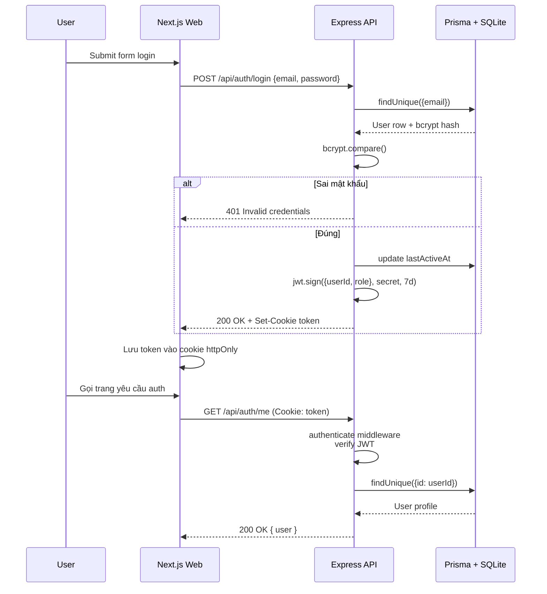

# Kiến trúc hệ thống

Tài liệu mô tả tổng quan kiến trúc của LinguaFlow, từ luồng request HTTP đến các thuật toán cốt lõi như spaced repetition (SM-2) và hệ thống gamification.

Tác giả: **Nguyễn Sơn** (`jasonbmt06@gmail.com`).

---

## 1. Sơ đồ tổng quan

```mermaid
flowchart LR
    subgraph Client
        BR[Browser / PWA]
        MO[Mobile App<br/>(roadmap)]
    end

    subgraph Frontend
        WEB[Next.js 14<br/>App Router]
        WEB -->|TanStack Query| API_CLIENT[lib/api-client.ts]
    end

    subgraph Backend
        API[Express + TypeScript]
        AUTH[(JWT Middleware)]
        VAL[Zod Validation]
        SVC[Services<br/>gamification, achievements, ai]
        PRISMA[Prisma ORM]
    end

    subgraph Data
        DB[(SQLite / PostgreSQL)]
    end

    subgraph External
        N8N[n8n Webhook]
        OPENAI[OpenAI API]
    end

    BR --> WEB
    MO -.-> WEB
    WEB -->|HTTPS JSON| API
    API_CLIENT -->|HTTPS JSON| API
    API --> AUTH
    AUTH --> VAL
    VAL --> SVC
    SVC --> PRISMA
    PRISMA --> DB
    SVC -->|provider chain| N8N
    SVC -->|fallback| OPENAI
```

| Layer | Trách nhiệm | Công nghệ chính |
|-------|-------------|-----------------|
| Client | Render UI, gọi API | Browser, PWA service worker |
| Frontend | App Router, server components, caching | Next.js 14, React 18, Tailwind, TanStack Query, Zustand |
| Backend | REST API, auth, validation, business logic | Express, TypeScript, Zod, Prisma |
| Data | Lưu trữ user, progress, content | SQLite (dev/CI), PostgreSQL-ready |
| External | AI Tutor, webhook tích hợp | n8n, OpenAI |

---

## 2. Tổ chức codebase

```
Language_App/
├── api/
│   ├── src/
│   │   ├── index.ts                # Bootstrap Express app
│   │   ├── routes/                 # 38 endpoint groups
│   │   ├── middleware/             # auth, error, logger, timeout, cache
│   │   ├── services/               # gamification, achievements, ai
│   │   ├── database/               # Prisma client + seeds
│   │   ├── controllers/            # legacy controllers
│   │   ├── validators/             # shared Zod schemas
│   │   └── __tests__/              # Vitest test suites
│   └── prisma/
│       ├── schema.prisma
│       └── migrations/
├── web/
│   ├── src/
│   │   ├── app/                    # 50+ pages (App Router)
│   │   ├── components/             # UI primitives + feature blocks
│   │   ├── hooks/                  # useDebounce, useLocalStorage, ...
│   │   ├── lib/                    # api-client, site-config, utils
│   │   ├── services/               # service layer giao tiếp API
│   │   └── types/                  # shared TypeScript types
│   └── e2e/                        # Playwright spec
└── shared/                         # types & utils dùng chung
```

---

## 3. Luồng xác thực



| Đặc tính | Chi tiết |
|----------|----------|
| Token TTL | 7 ngày |
| Storage | Cookie `token`, `httpOnly`, `secure` ở production |
| Algorithm | HS256, secret từ env `JWT_SECRET` |
| Hash mật khẩu | `bcryptjs` cost 12 |
| Rate limit auth | 10 request / 15 phút mỗi IP cho `/auth/login` và `/auth/register` |
| Logout | `res.clearCookie('token')`, không cần gọi backend khi token hết hạn |

---

## 4. Spaced Repetition (SM-2)

LinguaFlow áp dụng SM-2 (SuperMemo 2) cho ôn từ vựng. Triển khai trong [api/src/routes/vocabulary.ts](../api/src/routes/vocabulary.ts).

### Tham số

| Tham số | Mặc định | Ý nghĩa |
|---------|----------|---------|
| `easeFactor` | 2.5 | Hệ số dễ; càng thấp càng khó nhớ |
| `interval` (ngày) | 1 | Khoảng cách tới lần ôn tiếp theo |
| `reviewCount` | 0 | Số lần đã ôn |
| `quality` | 0-5 | Chất lượng câu trả lời (0=quên, 5=hoàn hảo) |
| `nextReview` | `now` | Thời điểm thẻ đến hạn ôn |

### Công thức cập nhật

```
ef' = max(1.3, ef + (0.1 - (5 - q) * (0.08 + (5 - q) * 0.02)))

if q < 3:
    interval' = 1
elif reviewCount == 1:
    interval' = 1
elif reviewCount == 2:
    interval' = 6
else:
    interval' = round(interval * ef')

nextReview = now + interval' days
known = (q >= 4) and (reviewCount >= 3)
```

### Bảng ánh xạ

| Quality | Diễn giải UI | Hành vi |
|---------|--------------|---------|
| 0 | Hoàn toàn quên | Reset interval về 1, ef giảm mạnh |
| 1 | Sai nặng | Reset interval về 1 |
| 2 | Sai (đoán được) | Reset interval về 1 |
| 3 | Đúng nhưng khó | Tăng interval, giữ ef gần như cũ |
| 4 | Đúng có suy nghĩ | Tăng interval, ef ổn định |
| 5 | Phản xạ tức thời | Tăng interval mạnh, ef tăng nhẹ |

Khi client chỉ truyền `known: boolean`, backend map sang `quality = 4` (đúng) hoặc `1` (sai).

---

## 5. Hệ thống gamification

```mermaid
flowchart TD
    A[User hoàn thành activity] -->|API gọi awardXP| B[gamification.ts]
    B --> C{lastActiveAt}
    C -->|diff = 1 ngày| D[streak += 1]
    C -->|diff > 1 ngày| E[streak = 1]
    C -->|cùng ngày| F[streak giữ nguyên]
    D --> G[Update user]
    E --> G
    F --> G
    G --> H[level = floor(xp/100) + 1]
    H --> I[checkAchievements]
    I --> J{Có achievement mới?}
    J -->|Có| K[UserAchievement.create + notify]
    J -->|Không| L[Trả result]
    K --> L
    L --> M[Client cập nhật UI: XP popup, streak flame]
```

### Định mức XP

| Hoạt động | XP cộng |
|-----------|---------|
| Hoàn thành lesson | `lesson.xpReward` (mặc định 25-50) |
| Quiz đúng | 5 |
| Listening đúng | 10 |
| Listening sai | 2 |
| Speaking pass (>= 60 điểm) | 15 |
| Speaking fail | 5 |
| Hoàn thành story | `story.xpReward * accuracy` |
| Daily challenge | `xpReward * (1 + streak * 0.1)` (cap 2x) |
| Daily quest hoàn thành cả 3 | bonus 30 |
| Onboarding | 10 |

### Hearts & Gems

| Tham số | Giá trị |
|---------|---------|
| `MAX_HEARTS` | 5 |
| `HEART_REFILL_MINUTES` | 30 |
| Refill bằng gems | 50 gems / lần đầy |
| Earn gems cap | 100/lần |

### Streak

- Streak chỉ tăng khi `lastActiveAt` cách hôm nay đúng 1 ngày.
- Streak reset về `1` nếu nhảy cóc hơn 1 ngày, về `0` ở route `/progress/streak` khi đã nghỉ quá 1 ngày.
- `streakFreeze` (mua từ shop, 200 gems) bảo vệ một ngày bị quên.

---

## 6. AI Tutor provider chain

```mermaid
flowchart LR
    USER[User message] --> CHAT[POST /api/chat/:sessionId/message]
    CHAT --> SVC[services/ai.ts<br/>getProvider()]
    SVC --> N{N8N_WEBHOOK_URL?}
    N -->|Yes| N8N[Call n8n webhook]
    N -->|No| O{OPENAI_API_KEY?}
    O -->|Yes| OAI[Call OpenAI compatible]
    O -->|No| MOCK[generateMockResponse]
    N8N -->|fail| MOCK
    OAI -->|fail| MOCK
    N8N --> RESP[Trả về AIResponse]
    OAI --> RESP
    MOCK --> RESP
    RESP --> CHAT
    CHAT --> CLIENT[Client hiển thị + corrections]
```

| Provider | Khi nào kích hoạt | Đặc điểm |
|----------|-------------------|----------|
| `n8n` | Có `N8N_WEBHOOK_URL` | Cho phép tự build flow tùy biến, tích hợp công cụ ngoài |
| `openai` | Có `OPENAI_API_KEY` | Dùng `OPENAI_BASE_URL` (mc định `https://api.openai.com/v1`), model `AI_MODEL` (mặc định `gpt-4o-mini`) |
| `mock` | Không có cả hai | Fallback offline, đảm bảo demo luôn hoạt động |

System prompt được build theo `language` và `role` (`teacher`, `friend`, `interviewer`, `restaurant`, `customer`, `doctor`, `travel`). Mỗi role có format response riêng, tích hợp gợi ý tiếng Việt cho người học Việt Nam.

---

## 7. Cơ chế caching và rate limit

| Lớp | Biện pháp | File |
|-----|-----------|------|
| Static asset (Web) | Next.js tự cache, headers `Cache-Control` mặc định | `web/next.config.js` |
| API GET | `cacheControl(60)` middleware đặt `Cache-Control: public, max-age=60` | [api/src/middleware/cache.ts](../api/src/middleware/cache.ts) |
| Rate limit global | `express-rate-limit` 100 req / 15 phút | [api/src/index.ts](../api/src/index.ts) |
| Rate limit auth | 10 req / 15 phút cho login/register | [api/src/index.ts](../api/src/index.ts) |
| Timeout | Mặc định 30s qua `requestTimeout` | [api/src/middleware/timeout.ts](../api/src/middleware/timeout.ts) |

---

## 8. Mô hình dữ liệu chính (rút gọn)

| Bảng | Mô tả |
|------|-------|
| `User` | Tài khoản, xp, level, streak, hearts, gems, role |
| `Language` / `Level` / `Lesson` | Cấu trúc nội dung học theo cấp |
| `Vocabulary` / `FlashcardProgress` | Từ vựng + tiến độ SM-2 (interval, ef, nextReview, bookmarked) |
| `Quiz` / `QuizAttempt` | Câu hỏi và lượt làm, dùng cho XP và analytics |
| `LessonProgress` | Tiến độ hoàn thành theo lesson, lưu score, timeSpent |
| `Enrollment` | Liên kết user với language/level đang học |
| `Achievement` / `UserAchievement` | Thành tựu mở khóa |
| `ChatSession` | Hội thoại AI Tutor (lưu messages JSON) |
| `Friendship` | Trạng thái pending/accepted giữa hai user |

Schema đầy đủ tại [api/prisma/schema.prisma](../api/prisma/schema.prisma).

---

## 9. Triển khai

| Môi trường | Nền tảng | Container? | DB |
|------------|----------|------------|-----|
| Local dev | Node 20 | Tùy chọn | SQLite file |
| CI | GitHub Actions Ubuntu | Không | SQLite tạm |
| Staging/Production API | Render Web Service Node 20 | Không (theo PROJECT_RULES) | SQLite trên persistent disk |
| Staging/Production Web | Vercel Edge | Không | - |
| Self-host | Docker Compose | Có | SQLite hoặc Postgres tùy cấu hình |

Chi tiết cấu hình deploy xem [DEPLOYMENT.md](DEPLOYMENT.md).

---

## 10. Kiểm thử & quan sát

| Loại | Tool | Vị trí |
|------|------|--------|
| Unit + Integration API | Vitest + Supertest | `api/src/__tests__/` |
| E2E Web | Playwright | `web/e2e/` |
| Type check | `tsc --noEmit` | `api/`, `web/` |
| Lint | ESLint | `web/` |
| Static security | CodeQL | GitHub Actions |
| Logs runtime | `morgan('dev')`, `console.error` | Stdout container |

Chi tiết test plan tại [TESTING.md](TESTING.md).
