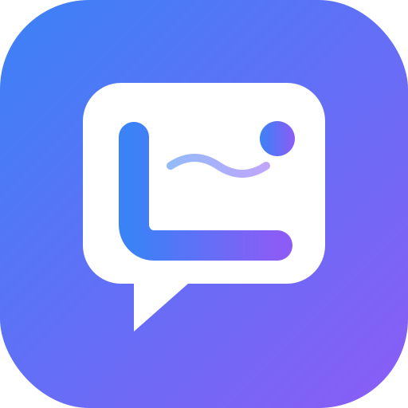

<p align="center">
  
</p>

<h1 align="center">LinguaFlow</h1>

<p align="center">
  <strong>Smart language learning platform for Vietnamese students</strong><br/>
  Learn English, Japanese, Chinese, and Korean with spaced repetition, gamification, and personalized learning paths.
</p>

<p align="center">
  <a href="#quick-overview">Overview</a> &bull;
  <a href="#features">Features</a> &bull;
  <a href="#tech-stack">Tech Stack</a> &bull;
  <a href="#installation">Install</a> &bull;
  <a href="#deployment">Deploy</a> &bull;
  <a href="#contributing">Contributing</a>
</p>

<p align="center">
  English | <a href="../README.md">Tiếng Việt</a>
</p>

<p align="center">
  <a href="https://github.com/JasonTM17/Language_App/actions/workflows/ci.yml"></a>
  <a href="https://github.com/JasonTM17/Language_App/actions/workflows/codeql.yml"></a>
  
  
  
  
  <a href="https://web-vert-phi-72.vercel.app"></a>
  <a href="https://linguaflow-api-ujjo.onrender.com"></a>
  <a href="../LICENSE"></a>
</p>

---

## Quick Overview

| Question | Answer |
|----------|--------|
| What is this? | Full-stack language learning platform with 50+ pages, 38 API endpoints, SM-2 spaced repetition, gamification, and AI tutor. |
| For whom? | Vietnamese students learning foreign languages (English, Japanese, Chinese, Korean) from Beginner to Advanced. |
| Tech stack? | Next.js 14, Express, Prisma, SQLite, TypeScript, Docker, GitHub Actions. |
| Deployed? | [API](https://linguaflow-api-ujjo.onrender.com) (Render) &bull; [Web](https://web-vert-phi-72.vercel.app) (Vercel) |
| Run locally? | `git clone` &rarr; `npm install` &rarr; `npm run dev` (see below) |
| Tests? | 129 integration tests, CI green, CodeQL security scanning. |

---

## Features

### Learning

| Feature | Description |
|---------|-------------|
| Vocabulary & Flashcards | SM-2 spaced repetition, pronunciation, contextual examples |
| Quiz | Multiple choice, fill-in-the-blank, listening comprehension, timer |
| Listening | Level-based audio exercises, transcripts, adjustable speed |
| Speaking & Pronunciation | Speech recognition practice |
| Reading & Writing | Comprehension, essays, automated grammar correction |
| Grammar Tips | Topic-based grammar with real-world examples |
| Sentence Builder | Sentence assembly, translation, word ordering |
| Stories | Bilingual short stories by level |
| AI Tutor | Smart conversations, grammar correction, vocabulary suggestions |

### Gamification

| Feature | Description |
|---------|-------------|
| XP & Levels | Experience points, leveling, rewards |
| Streak & Hearts | Daily streak counter, lives system |
| Leaderboard | Weekly/monthly/all-time rankings |
| Achievements | Unlockable badges and milestones |
| Daily Challenge | Daily challenges with bonus rewards |
| Quests | Short-term and long-term missions |
| Shop | Item exchange using XP |
| Skill Tree | Tree-based learning path with unlocking |

### Platform

| Feature | Description |
|---------|-------------|
| Multi-language | English, Japanese, Chinese, Korean |
| Dark Mode | Auto theme based on system preference |
| Responsive | Optimized for Desktop, Tablet, Mobile |
| PWA | Installable as native app, offline-ready |
| Notifications | Study reminders, streak warnings, new achievements |
| Search | Find vocabulary, lessons, content |
| Friends | Add friends, track progress, challenge |
| Analytics | Detailed study time stats, strengths/weaknesses |

---

## Tech Stack

| Layer | Technology |
|-------|-----------|
| Frontend | Next.js 14 (App Router), React 18, TypeScript 5.4 |
| Styling | Tailwind CSS 3.4, Radix UI, Framer Motion |
| State Management | Zustand, TanStack Query v5 |
| Backend | Express.js, TypeScript, Prisma ORM |
| Database | SQLite (dev/CI), PostgreSQL-ready |
| Authentication | JWT access tokens, bcryptjs, cookie-based sessions |
| Validation | Zod schemas (shared frontend/backend) |
| AI Integration | OpenAI-compatible API, n8n workflows, mock fallback |
| Security | Helmet, CORS, Rate Limiting, CodeQL |
| Testing | Vitest, Supertest, Playwright |
| Infrastructure | Docker, Docker Compose, GitHub Actions CI/CD |
| Deployment | Vercel (Web), Render (API) |

---

## Installation

### Prerequisites

| Tool | Version | Check |
|------|---------|-------|
| Node.js | >= 20.0 | `node -v` |
| npm | >= 10.0 | `npm -v` |
| Docker | latest (optional) | `docker -v` |

### Quick Setup

```bash
git clone https://github.com/JasonTM17/Language_App.git
cd Language_App

# Install dependencies
cd api && npm install && cd ../web && npm install && cd ..

# Configure environment
cp api/.env.example api/.env

# Initialize database and seed sample data
cd api
npx prisma migrate dev
npm run db:seed
cd ..
```

### Run Development

```bash
# Terminal 1 — API (port 3001)
cd api && npm run dev

# Terminal 2 — Web (port 3000)
cd web && npm run dev
```

### Services After Startup

| Service | URL | Description |
|---------|-----|-------------|
| Web App | http://localhost:3000 | User interface |
| API | http://localhost:3001/api | REST API |
| Health Check | http://localhost:3001/api/health | Server status |
| Prisma Studio | http://localhost:5555 | Database GUI (run `npx prisma studio`) |

### Docker

```bash
# Run full stack
docker compose up --build

# Or pull from Docker Hub
docker pull nguyenson1710/linguaflow-api:v1.1.0
docker pull nguyenson1710/linguaflow-web:v1.1.0
docker compose up -d
```

---

## Demo Accounts

| Role | Email | Password |
|------|-------|----------|
| User | `user@linguaflow.app` | `user123` |
| Admin | `admin@linguaflow.app` | `admin123` |

---

## Deployment

### Production URLs

| Service | URL | Platform | Status |
|---------|-----|----------|:------:|
| API | https://linguaflow-api-ujjo.onrender.com | Render | Live |
| Web | https://web-vert-phi-72.vercel.app | Vercel | Live |

### Docker Hub

| Image | Tags |
|-------|------|
| `nguyenson1710/linguaflow-api` | `v1.1.0`, `latest` |
| `nguyenson1710/linguaflow-web` | `v1.1.0`, `latest` |

### GitHub Container Registry

| Image | Tags |
|-------|------|
| `ghcr.io/jasontm17/linguaflow-api` | `v1.1.0`, `latest` |
| `ghcr.io/jasontm17/linguaflow-web` | `v1.1.0`, `latest` |

---

## Documentation

| Document | Description |
|----------|-------------|
| [Architecture](ARCHITECTURE.md) | System architecture, data flow, SM-2 algorithm, gamification, AI provider chain |
| [API Reference](api.md) | Full documentation of 38 endpoints with request/response examples |
| [UI Guidelines](UI_GUIDELINES.md) | Design tokens, components, dark mode, accessibility, responsive |
| [Deployment](DEPLOYMENT.md) | Vercel, Render, Docker, CI/CD setup guide |
| [Container Images](container-images.md) | Docker images, tags, env vars, healthchecks, security verify |
| [Testing](TESTING.md) | Test strategy, 16 test suites, Vitest patterns, Playwright E2E |
| [Review Evidence](REVIEW_EVIDENCE.md) | Reviewer evidence pack — verifiable links for all production claims |
| [Honest Scope](HONEST_SCOPE.md) | What this is / is not, trade-offs, limitations |
| [Release Notes v1.1.0](RELEASE_NOTES_v1.1.0.md) | Public-facing release notes |
| [UI Audit Report](UI_AUDIT_REPORT.md) | UI/UX audit report (P0/P1/P2) |
| [Contributing](../CONTRIBUTING.md) | Contribution workflow, commit convention |
| [Security](../SECURITY.md) | Vulnerability reporting, supported versions |
| [Code of Conduct](../CODE_OF_CONDUCT.md) | Contributor Covenant 2.1 |
| [Changelog](../CHANGELOG.md) | Change history (Keep a Changelog format) |

---

## Contributing

See [CONTRIBUTING.md](../CONTRIBUTING.md) for details.

```bash
# Quick contribution flow
git checkout -b feature/feature-name
# ... code ...
git commit -m "feat: brief description"
git push origin feature/feature-name
# Open a Pull Request on GitHub
```

---

## Project Scope

This is a personal portfolio project demonstrating full-stack development skills.

**This is**: A full-stack web application with production-grade architecture, CI/CD pipeline, Docker containerization, 129 integration tests, security scanning, and automated deployment.

**This is not**: A SaaS product with real user traffic, billing system, or enterprise SLA.

For details, see [HONEST_SCOPE.md](HONEST_SCOPE.md).

---

## License

MIT License &mdash; see [LICENSE](../LICENSE).

---

## Author

**Nguyễn Sơn**

[](https://github.com/JasonTM17)
[](mailto:jasonbmt06@gmail.com)

This is a learning project for honing full-stack software development skills. Feedback and contributions are welcome &mdash; please send to the email above.

---

<p align="center">
  <a href="#linguaflow">Back to top</a>
</p>
